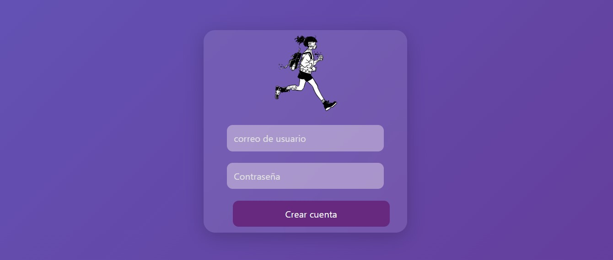
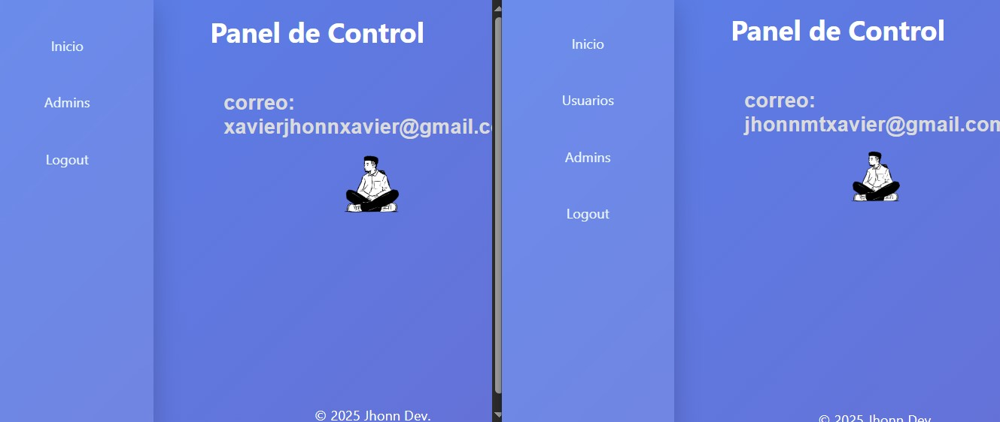

# 📌 Proyecto de authenticación 🔑

## Inicio de session

## Crear cuenta

## Dashboard

## Descripción

> Este proyecto es una una serie de buenas practicas al momento de realizar una autenticación e inicio de session mediante diferentes maneras con JavaScript, Nodejs y Express que permite mostrar la practica en backend.

---

### Contenido adicional:

- ✅ Funcionalidades principales
    - Conectar base de datos ✅
    - insertar y hacer login ✅
    - validar errores de forma basica.✅
    - contraseña con sal ✅
    - autenticacion de correo ✅ .
    - recuperar contraseña ✅
    - inicio de session con google 🔁
    - inicio de session con face o redes sociales. 🕒
    - manejo de midlewares 🕓
- 🛠️ Tecnologías usadas
    - JavaScript.
    - Nodejs.
    - Express.
    - Motor de Plantillas EJS.
    - SweatAlert2.
---
